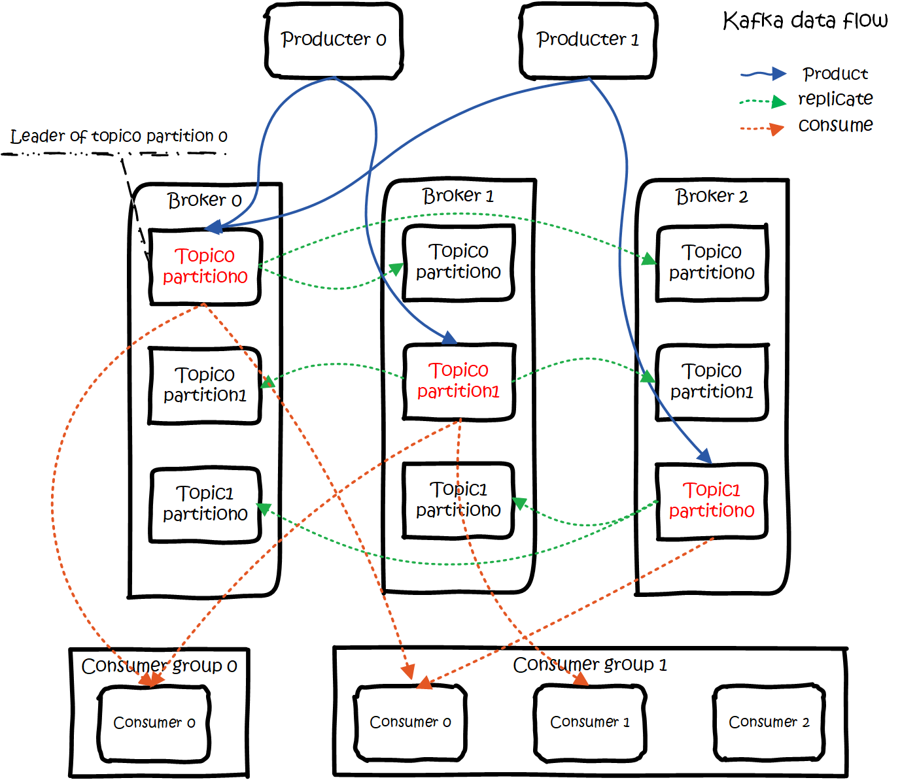
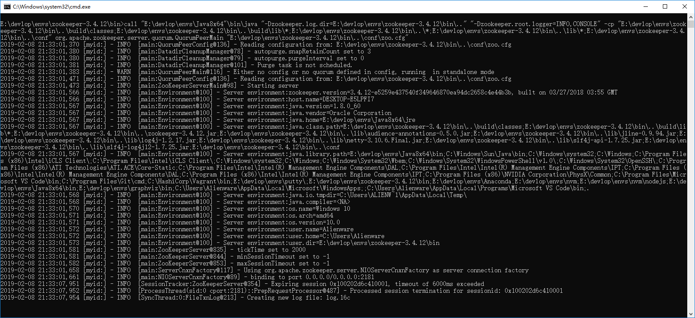
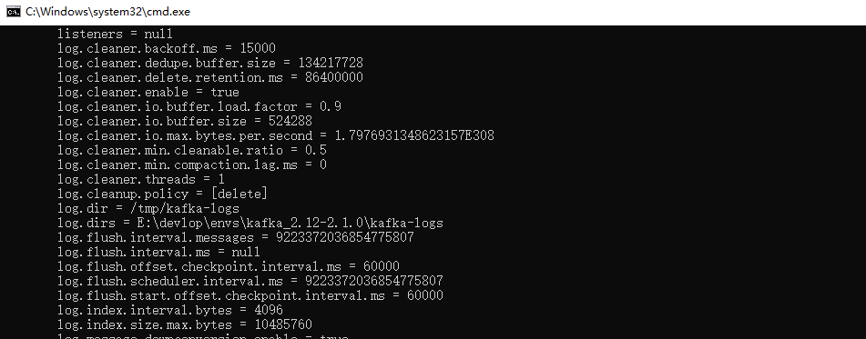

# 概述

在上一篇文章中介绍了，如何在`select`语句中使用`stream`关键字，进行`流查询`,并且模拟了简单数据结构，有兴趣的同学可以移步去看看( [streaming上篇](https://github.com/dafei1288/CalciteDocTrans/blob/master/streaming.1.md))。本文将会继续扩展这个案例，把`calcite`和`kafka`联合起来，将`kafka`作为数据提供者，并进行`SQL`查询。

# 什么是 kafka

`kafka` 是一个分布式消息队列。具有高性能、持久化、多副本备份、横向扩展能力。生产者往队列里写消息，消费者从队列里取消息进行业务逻辑。一般在架构设计中起到解耦、削峰、异步处理的作用。
`kafka`对外使用`topic`的概念，生产者往`topic`里写消息，消费者从读消息。为了做到水平扩展，一个`topic`实际是由多个`partition`组成的，遇到瓶颈时，可以通过增加`partition`的数量来进行横向扩容。单个`parition`内是保证消息有序。
每新写一条消息，`kafka`就是在对应的文件`append写`，所以性能非常高。
`kafka`的总体数据流是这样的：



大概用法就是，`Producers`往`Brokers`里面的指定`Topic`中写消息，`Consumers`从`Brokers`里面拉去指定`Topic`的消息，然后进行业务处理。

`以上内容这部分引用自：https://www.jianshu.com/p/d3e963ff8b70 `

至于什么是`zookeeper`？有兴趣的读者自行搜索吧,这里就不过多介绍了...


# kafka 环境搭建

本章以`windows`环境下搭建`kafka`环境为例，如果您已经熟悉这部分内容，可以跳过这个章节。搭建测试的方法有很多，这里我们使用一种较为便捷且成功率较高的方式。

## zookeeper 环境搭建

- 下载并解压zookeeper `http://zookeeper.apache.org/releases.html#download` 
- 进入解压后的文件夹的`conf目录`，复制`zoo_sample.cfg`重命名成`zoo.cfg`
- 编辑`zoo.cfg`文件，修改`dataDir`为`dataDir=$zookeeper解压路径\data`，这个路径可自行配置，只要有权限写入即可
- 添加环境变量`ZOOKEEPER_HOME`，指向`zookeeper解压路径`
- 在`PATH`变量里添加`ZOOKEEPER_HOME\bin`
- 新建一个命令行，执行`zkServer`



## kafka 环境搭建

- 下载并解压kafka `http://kafka.apache.org/downloads` , 下载的时候，注意`scala`版本，后续开发，可能会有影响
- 进入解压后的文件夹的`config目录`
- 编辑`server.properties`文件，修改`log.dirs=$kafka解压路径\kafka-logs`，这个路径可自行配置，只要有权限写入即可
- 在`kafka解压路径`执行`.\bin\windows\kafka-server-start.bat .\config\server.properties`，建议将此命令，保存为`start.cmd`存放在该路径下，以便日后使用



# kafka 环境测试

我们已经搭建起来了一个简单的`kafka`环境，接下来我们需要测试一下环境

首先，在之前的工程里加入`kafka`的依赖

```
    compile group: 'org.apache.kafka', name: 'kafka_2.12', version: '2.1.0'
    compile group: 'org.apache.kafka', name: 'kafka-clients', version: '2.1.0'
    compile group: 'org.apache.kafka', name: 'kafka-streams', version: '2.1.0'
```

然后来创建主题

## 创建 topic

```
package com.dafei1288.calcite.stream.kafka;

import org.apache.kafka.clients.admin.AdminClient;
import org.apache.kafka.clients.admin.CreateTopicsResult;
import org.apache.kafka.clients.admin.NewTopic;

import java.util.ArrayList;
import java.util.Properties;
import java.util.concurrent.ExecutionException;

public class CreateTopic {
    public static void main(String[] args) {
        //创建topic
        Properties props = new Properties();
        props.put("bootstrap.servers", "localhost:2181");
        AdminClient adminClient = AdminClient.create(props);
        ArrayList<NewTopic> topics = new ArrayList<NewTopic>();
        NewTopic newTopic = new NewTopic("calcitekafka", 1, (short) 1);
        topics.add(newTopic);
        CreateTopicsResult result = adminClient.createTopics(topics);
        try {
            result.all().get();
        } catch (InterruptedException e) {
            e.printStackTrace();
        } catch (ExecutionException e) {
            e.printStackTrace();
        }
    }
}

```

创建`topic`以后，我们来构建一个基础的生产者`producter`。

## 创建 producter

```
package com.dafei1288.calcite.stream.kafka;

import org.apache.kafka.clients.producer.KafkaProducer;
import org.apache.kafka.clients.producer.ProducerRecord;

import java.util.Properties;
import java.util.Random;

public class Producter {
    private static KafkaProducer<String, String> producer;
    //刚才构建的topic
    private final static String TOPIC = "calcitekafka";
    public Producter(){
        Properties props = new Properties();
        props.put("bootstrap.servers", "localhost:9092");
        props.put("acks", "all");
        props.put("retries", 0);
        props.put("batch.size", 16384);
        props.put("linger.ms", 1);
        props.put("buffer.memory", 33554432);
        props.put("key.serializer", "org.apache.kafka.common.serialization.StringSerializer");
        props.put("value.serializer", "org.apache.kafka.common.serialization.StringSerializer");
        //设置分区类,根据key进行数据分区
        producer = new KafkaProducer<String, String>(props);
    }
    public void produce(){
        int i = 0;
        Random r = new Random();
        for(;;){
            //每一秒创建一个随机的布尔值
            producer.send(new ProducerRecord<String, String>(TOPIC,i+++"",r.nextBoolean()+"" ));
            try {
                Thread.sleep(1000);
            } catch (InterruptedException e) {
                e.printStackTrace();
            }
        }
       // producer.close();
    }

    public static void main(String[] args) {
        new Producter().produce();
    }
}
```

由于没有正式的业务场景，我们进行一个简单的模拟，每秒生成一个随机的布尔值，一直循环下去，有了生产者，下面我们来构建一个消费者。

## 创建 consumer

```
package com.dafei1288.calcite.stream.kafka;

import org.apache.kafka.clients.consumer.ConsumerRecord;
import org.apache.kafka.clients.consumer.ConsumerRecords;
import org.apache.kafka.clients.consumer.KafkaConsumer;

import java.util.Arrays;
import java.util.Properties;

public class Consumer {
    private static KafkaConsumer<String, String> consumer;
    private final static String TOPIC = "calcitekafka";
    public Consumer(){
        Properties props = new Properties();
        props.put("bootstrap.servers", "localhost:9092");
        //每个消费者分配独立的组号
        props.put("group.id", "test2");
        //如果value合法，则自动提交偏移量
        props.put("enable.auto.commit", "true");
        //设置多久一次更新被消费消息的偏移量
        props.put("auto.commit.interval.ms", "1000");
        //设置会话响应的时间，超过这个时间kafka可以选择放弃消费或者消费下一条消息
        props.put("session.timeout.ms", "30000");
        //自动重置offset
        props.put("auto.offset.reset","earliest");
        props.put("key.deserializer",
                "org.apache.kafka.common.serialization.StringDeserializer");
        props.put("value.deserializer",
                "org.apache.kafka.common.serialization.StringDeserializer");
        consumer = new KafkaConsumer<String, String>(props);
    }

    public void consume(){
        consumer.subscribe(Arrays.asList(TOPIC));
        while (true) {
            ConsumerRecords<String, String> records = consumer.poll(100);
            for (ConsumerRecord<String, String> record : records){
                System.out.printf("offset = %d, key = %s, value = %s",record.offset(), record.key(), record.value());
                System.out.println();
            }
        }
    }

    public static void main(String[] args) {
        new Consumer().consume();
    }
}
```

这里就是简单的将数据在控制台，进行一下输出，片段如下：

```
offset = 328, key = 0, value = false
offset = 329, key = 1, value = false
offset = 330, key = 2, value = true
offset = 331, key = 3, value = true
offset = 332, key = 4, value = false
offset = 333, key = 5, value = false
offset = 334, key = 6, value = true
offset = 335, key = 7, value = true
offset = 336, key = 8, value = false
offset = 337, key = 9, value = true
offset = 338, key = 10, value = true
offset = 339, key = 11, value = true
```

这样就说明之前我们搭建的`kafka`环境成功了，下面我们来和`calcite`进行整合，代替前文案例中，我们自己撰写的`storage`

# calcite 整合 kafka

我们这次的目的是取代之前使用`java`文件来存储的数据，而是使用`kafka`作为数据的提供者，首先我们需要重新构建一个`schema`文件

## 创建 kafkaStream.json

```
{
  "version": "1.0",
  "defaultSchema": "bookshopstream",
  "schemas": [
    {
      "name": "bookshopstream",
      "tables": [
        {
          "name": "KF",
          "type": "custom",
          "factory": "com.dafei1288.calcite.stream.kafka.KafkaStreamTableFactory",
          "stream": {
            "stream": true
          },
          "operand": {
            "topic": "calcitekafka",
            "bootstrap.servers": "localhost:9092",
            "group.id": "test2",
            "enable.auto.commit": "true",
            "auto.commit.interval.ms": "1000",
            "session.timeout.ms": "30000",
            "auto.offset.reset":"earliest",
            "key.deserializer": "org.apache.kafka.common.serialization.StringDeserializer",
            "value.deserializer": "org.apache.kafka.common.serialization.StringDeserializer",
            "colnames": "KK,VV",
            "timeouts": "2000"
          }
        }
      ]
    }
  ]
}
```

在这里，我们重新构建了一个`factory`,它是`com.dafei1288.calcite.stream.kafka.KafkaStreamTableFactory`，这个类的具体内容，我们下面会详细介绍。

__请注意，在`operand`里的配置，我们加入了一系列配置，这是从通用性考虑，我们将`kafka`以及其他必要配置全部写在了这里面。__

接下来，我们看一下`com.dafei1288.calcite.stream.kafka.KafkaStreamTableFactory`,做了一些什么？

## KafkaStreamTableFactory

```
package com.dafei1288.calcite.stream.kafka;

import org.apache.calcite.rel.type.RelDataType;
import org.apache.calcite.schema.SchemaPlus;
import org.apache.calcite.schema.Table;
import org.apache.calcite.schema.TableFactory;

import java.util.Map;

public class KafkaStreamTableFactory implements TableFactory {
    @Override
    public Table create(SchemaPlus schema, String name, Map operand, RelDataType rowType) {
        System.out.println(operand);
        System.out.println(name);
        return new KafkaStreamTable(name,operand);
    }
}

```

这个类，和之前的类职责基本相同，代码也几乎一致，只是在返回的时候，变成了`return new KafkaStreamTable(name,operand);`，这里我们将operand直接作为参数下发到了，`Table`类的实现里，这里是为了提高`Table`的灵活性，将职责下发。而不是像之前案例那样。

## KafkaStreamTable

`KafkaStreamTable`这个类，是这个案例最有意思的部分,我们先来看一下代码

```
package com.dafei1288.calcite.stream.kafka;

import org.apache.calcite.DataContext;
import org.apache.calcite.linq4j.AbstractEnumerable;
import org.apache.calcite.linq4j.Enumerable;
import org.apache.calcite.linq4j.Enumerator;
import org.apache.calcite.rel.type.RelDataType;
import org.apache.calcite.rel.type.RelDataTypeFactory;
import org.apache.calcite.schema.ScannableTable;
import org.apache.calcite.schema.StreamableTable;
import org.apache.calcite.schema.Table;
import org.apache.calcite.schema.impl.AbstractTable;
import org.apache.calcite.sql.type.SqlTypeUtil;
import org.apache.kafka.clients.consumer.ConsumerRecord;
import org.apache.kafka.clients.consumer.ConsumerRecords;
import org.apache.kafka.clients.consumer.KafkaConsumer;

import java.util.Arrays;
import java.util.Iterator;
import java.util.Map;


public class KafkaStreamTable extends AbstractTable implements StreamableTable, ScannableTable {

    @Override
    public Table stream() {
        return  this;
    }

    private String name;
    private RelDataType dataType;
    private Map operand;
    private static KafkaConsumer<String, String> consumer;

    public KafkaStreamTable(String name){
        System.out.println("KafkaStreamTable !!!!!!    "+name );
        this.name = name;
    }

    public KafkaStreamTable(String name, Map operand) {
        System.out.println("KafkaStreamTable !!!!!!    "+name +" , "+operand);
        this.name = name;
        this.operand = operand;


    }

    @Override
    public RelDataType getRowType(RelDataTypeFactory typeFactory) {
//        System.out.println("RelDataType !!!!!!");
        if(dataType == null) {
            RelDataTypeFactory.FieldInfoBuilder fieldInfo = typeFactory.builder();
            //我们需要存储stream table的元数据信息，为了案例，我写在了kafkaStream.json文件里配置信息里colnames
            for (String col : operand.get("colnames").toString().split(",")) {
                RelDataType sqlType = typeFactory.createJavaType(String.class);
                sqlType = SqlTypeUtil.addCharsetAndCollation(sqlType, typeFactory);
                fieldInfo.add(col, sqlType);
            }
            this.dataType = typeFactory.createStructType(fieldInfo);
        }
        return this.dataType;
    }


    @Override
    public Enumerable<Object[]> scan(DataContext root) {
        System.out.println("scan ...... ");
        consumer = new KafkaConsumer<String, String>(operand);
        consumer.subscribe(Arrays.asList(operand.get("topic").toString()));

        return new AbstractEnumerable<Object[]>() {

            public Enumerator<Object[]> enumerator() {
                return new Enumerator<Object[]>(){
                    //因为，刚才的producter里面，数据是每秒产生的，如果这里值太下，则会出现取不出值的可能
                    ConsumerRecords<String, String> records = consumer.poll(Integer.parseInt(operand.get("timeouts").toString()));
                    Iterator it =records.iterator();
                    private int cur = 0;
                    @Override
                    public Object[] current() {
                        ConsumerRecord<String, String> reco = (ConsumerRecord<String, String>) it.next();
                        return new String[]{reco.key(),reco.value()};
                    }

                    @Override
                    public boolean moveNext() {
                        //ConsumerRecord<String, String> record : records
                        return it.hasNext();
                    }

                    @Override
                    public void reset() {

                    }

                    @Override
                    public void close() {
                        consumer.close();
                    }
                };
            }
        };
    }
}
```

这个类的职责与之前的`InMemoryTable`类似，即提供数据如何遍历，如何转化数据类型。

前文提及将何定义一个`streaming`的职责下发到此类里,这是为了提高了灵活性，即如果不使用`kafka`提供数据，想使用其他的`streaming`工具来构造数据，也会变得相对简单一些。

在`public RelDataType getRowType(RelDataTypeFactory typeFactory)`这个方法里，我们需要对流里的数据，提供元数据的类型映射，前文提到过，我是把元数据，放在了`kafkaStream.json`文件里的`operand`节中的`colnames`属性里，这里，`producter`的数据提供，只有一个`key`和一个`boolean`值，所以我们只创建了两列`KK`和`VV`。而为了演示，我们也粗暴的将数据类型，定义为`string`类型。

接下来，我们将在`public Enumerable<Object[]> scan(DataContext root)`方法里，订阅`kafka`的主题，并消费其发射来的数据。由于我们的生产者是每秒产生一次数据，所以在`consumer.poll(Integer.parseInt(operand.get("timeouts").toString()));`这里，我们不能把时间设置的太小，否则会出现取不出数据的情况，我们可以通过在`operand`里加入类似参数`"max.poll.records": 20,`来控制每页数据量。

到这里，我们的基础工作完成了，下面来测试一下

## 测试

```
package com.dafei1288.calcite.stream.kafka;

import org.apache.calcite.jdbc.CalciteConnection;
import org.apache.calcite.util.ConversionUtil;

import java.sql.Connection;
import java.sql.DriverManager;
import java.sql.ResultSet;
import java.sql.Statement;
import java.util.Properties;

public class TestKafkaStreamJDBC {
    public static void main(String[] args) {
        try {
            Class.forName("org.apache.calcite.jdbc.Driver");
        } catch (ClassNotFoundException e1) {
            e1.printStackTrace();
        }
        System.setProperty("saffron.default.charset", ConversionUtil.NATIVE_UTF16_CHARSET_NAME);
        System.setProperty("saffron.default.nationalcharset",ConversionUtil.NATIVE_UTF16_CHARSET_NAME);
        System.setProperty("saffron.default.collation.name",ConversionUtil.NATIVE_UTF16_CHARSET_NAME + "$en_US");

        Properties info = new Properties();
        String jsonmodle = "E:\\working\\others\\写作\\calcitetutorial\\src\\main\\resources\\kafkaStream.json";
        try {
            Connection connection =
                    DriverManager.getConnection("jdbc:calcite:model=" + jsonmodle, info);
            CalciteConnection calciteConn = connection.unwrap(CalciteConnection.class);

            ResultSet result = null;

            Statement st = connection.createStatement();

            st = connection.createStatement();
            //where b.name = '数据山'
            result = st.executeQuery("select stream kf.kk,kf.vv from KF as kf ");
            while(result.next()) {
                System.out.println(result.getString(1)+" \t "+result.getString(2));
            }

            result.close();
        }catch(Exception e){
            e.printStackTrace();
        }

        }
}

```

可以看到我们的测试语句 `select stream kf.kk,kf.vv from KF as kf`，结果如下

```
{topic=calcitekafka, bootstrap.servers=localhost:9092, group.id=test2, enable.auto.commit=true, auto.commit.interval.ms=1000, session.timeout.ms=30000, auto.offset.reset=earliest, key.deserializer=org.apache.kafka.common.serialization.StringDeserializer, value.deserializer=org.apache.kafka.common.serialization.StringDeserializer, colnames=key,value, timeouts=2000, modelUri=E:\working\others\写作\calcitetutorial\src\main\resources\kafkaStream.json, baseDirectory=E:\working\others\写作\calcitetutorial\src\main\resources}
KF
KafkaStreamTable !!!!!!    KF , {topic=calcitekafka, bootstrap.servers=localhost:9092, group.id=test2, enable.auto.commit=true, auto.commit.interval.ms=1000, session.timeout.ms=30000, auto.offset.reset=earliest, key.deserializer=org.apache.kafka.common.serialization.StringDeserializer, value.deserializer=org.apache.kafka.common.serialization.StringDeserializer, colnames=key,value, timeouts=2000, modelUri=E:\working\others\写作\calcitetutorial\src\main\resources\kafkaStream.json, baseDirectory=E:\working\others\写作\calcitetutorial\src\main\resources}
scan ...... 
283 	 false
284 	 false
285 	 false
286 	 true
287 	 true
288 	 true
289 	 false
290 	 false
291 	 false
292 	 true
293 	 false
294 	 true
295 	 false
296 	 true
297 	 true
```

到这，基础整合完成了。

# 结尾

当前案例仅完成了初步整合，后续会继续扩展这个案例，例如时间窗滑动等，敬请期待

TBD 