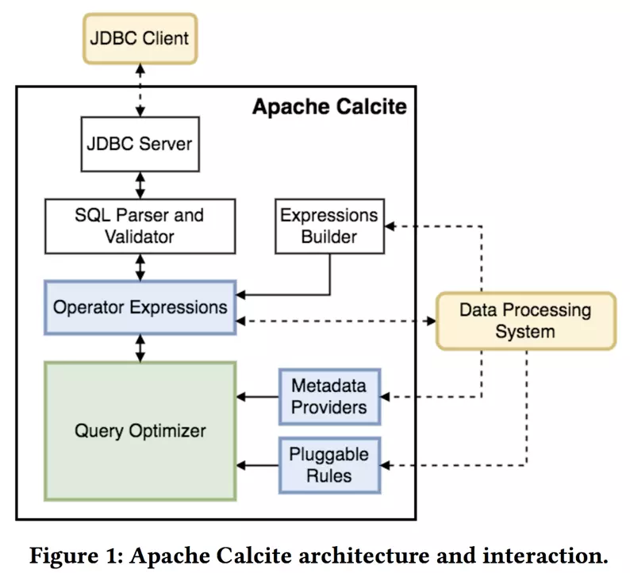

# 前言

Apache Calcite 是独立于存储与执行的SQL解析、优化引擎，广泛应用于各种离线、搜索、实时查询引擎，如Drill、Hive、Kylin、Solr、flink、Samza等。



偶然的机会了解到这个项目，然后就深深的为之着迷了，很感慨为什么没能早几年遇到她。也是为了更加了解她，光读文档不过瘾了，所以想动手翻译一下。 但是本人英文水平有限，又是第一次干这种事，所以欢迎大家帮我勘正谬误。 [联系我：dafei1288@sina.com](mailto:dafei1288@sina.com) 欢迎转载，请注明出处。

我们先从引导文件开始：[原文链接](http://calcite.apache.org/docs/tutorial.html)


# 正文

这是一个手把手式文档，教你如何构建并且连接到`Calcite`。我们用一个简单的适配器来将一个包含[CSV](https://en.wikipedia.org/wiki/Comma-separated_values)文件的目录变成一个包含数据表的数据库(原文描述为`schema`)。`Calcite`可以提供一个完整的SQL接口。

`Calcite-example-CSV`是一个全功能适配器来使得`Calcite`可以读取`CSV`格式文件。可以通过几百行代码就能够完成一个全SQL查询功能。

`CSV`适配器可以作为抛砖引玉的模板套用到其他数据格式上。尽管他代码量不多，但是麻雀虽小五脏俱全，重要原理都包含其中：

1. 使用`SchemaFactory`和`Schema interfaces`来自定义`schema`
2. 使用固定格式的JSON文件来(`a model JSON file`模型文件)声明数据库(`schemas`)
3. 使用固定格式的JSON文件来(`a model JSON file`模型文件)声明视图(`views`)
4. 使用`Table interface`来自定义表(`Table`)
5. 确定表格的记录类型
6. 使用`ScannableTable interface`来实现一个简单的表(`Table`)，来枚举所有行(`rows`)
7. 进阶实现`FilterableTable`，可以根据条件(`simple predicates`)来过滤数据
8. 表的进阶实现`TranslatableTable`,将执行计划翻译成关系运算(`translates to relational operators using planner rules`)

## 下载和编译

需要Java环境(1.7及以上版本，推荐1.8)，git以及maven(3.2.1及以上版本)

```
$ git clone https://github.com/apache/calcite.git
$ cd calcite
$ mvn install -DskipTests -Dcheckstyle.skip=true
$ cd example/csv
```

## 第一个查询

现在让我们来使用[sqlline](https://github.com/julianhyde/sqlline)来连接`Calcite`，`sqlline`是一个包含在整个`Calcite`项目里的SQL的命令行工具。

```
$ ./sqlline
sqlline> !connect jdbc:calcite:model=target/test-classes/model.json admin admin
```

(如果是windows操作系统，使用`sqlline.bat`)

执行一个元数据查询：

```
sqlline> !tables
+------------+--------------+-------------+---------------+----------+------+
| TABLE_CAT  | TABLE_SCHEM  | TABLE_NAME  |  TABLE_TYPE   | REMARKS  | TYPE |
+------------+--------------+-------------+---------------+----------+------+
| null       | SALES        | DEPTS       | TABLE         | null     | null |
| null       | SALES        | EMPS        | TABLE         | null     | null |
| null       | SALES        | HOBBIES     | TABLE         | null     | null |
| null       | metadata     | COLUMNS     | SYSTEM_TABLE  | null     | null |
| null       | metadata     | TABLES      | SYSTEM_TABLE  | null     | null |
+------------+--------------+-------------+---------------+----------+------+
```

(*译者注：上面案例里使用的`!tables`命令查询元数据，但是译者在使用的时候发现这个命令不好使)

```
0: jdbc:calcite:model=target/test-classes/mod> !table
+-----------+-------------+------------+------------+---------+----------+------------+-----------+---------------------------+----------------+
| TABLE_CAT | TABLE_SCHEM | TABLE_NAME | TABLE_TYPE | REMARKS | TYPE_CAT | TYPE_SCHEM | TYPE_NAME | SELF_REFERENCING_COL_NAME | REF_GENERATION |
+-----------+-------------+------------+------------+---------+----------+------------+-----------+---------------------------+----------------+
|           | SALES       | DEPTS      | TABLE      |         |          |            |           |                           |                |
|           | SALES       | EMPS       | TABLE      |         |          |            |           |                           |                |
|           | SALES       | SDEPTS     | TABLE      |         |          |            |           |                           |                |
|           | metadata    | COLUMNS    | SYSTEM TABLE |         |          |            |           |                           |                |
|           | metadata    | TABLES     | SYSTEM TABLE |         |          |            |           |                           |                |
+-----------+-------------+------------+------------+---------+----------+------------+-----------+---------------------------+----------------+
```
(JDBC提示： 在`sqlline`里`!tables`命令只是执行了`DatabaseMetaData.getTables()`方法，还有其他的获取元数据命令如：`!columns`,`!describe`) 

(译者注：`!describe`需要加表名)

```
0: jdbc:calcite:model=target/test-classes/mod> !describe
Usage: describe <table name>

0: jdbc:calcite:model=target/test-classes/mod> !describe DEPTS
+-----------+-------------+------------+-------------+-----------+-----------+-------------+---------------+----------------+----------------+----------+---------+------------+---------------+------------------+-------------------+------------------+-------------+---------------+--------------+-------------+

| TABLE_CAT | TABLE_SCHEM | TABLE_NAME | COLUMN_NAME | DATA_TYPE | TYPE_NAME | COLUMN_SIZE | BUFFER_LENGTH | DECIMAL_DIGITS | NUM_PREC_RADIX | NULLABLE | REMARKS | COLUMN_DEF | SQL_DATA_TYPE | SQL_DATETIME_SUB | CHAR_OCTET_LENGTH | ORDINAL_POSITION | IS_NULLABLE | SCOPE_CATALOG | SCOPE_SCHEMA | SCOPE_TABLE |

+-----------+-------------+------------+-------------+-----------+-----------+-------------+---------------+----------------+----------------+----------+---------+------------+---------------+------------------+-------------------+------------------+-------------+---------------+--------------+-------------+

|           | SALES       | DEPTS      | DEPTNO      | 4         | INTEGER   | -1          | null          | null           | 10             | 1        |         |            | null          | null             | -1                | 1                | YES         |               |              |             |

|           | SALES       | DEPTS      | NAME        | 12        | VARCHAR CHARACTER SET "ISO-8859-1" COLLATE "ISO-8859-1$en_US$primary" | -1          | null          | null           | 10             | 1        |         |            | null          | null             | -1                | 2               |

+-----------+-------------+------------+-------------+-----------+-----------+-------------+---------------+----------------+----------------+----------+---------+------------+---------------+------------------+-------------------+------------------+-------------+---------------+--------------+-------------+

```

你能看到，在执行`!tables`的时候有5个表，表`EMPS`, `DEPTS`和`HOBBIES`在`SALES`库(`schema`)里,表`COLUMNS`和`TABLES`在系统元数据库(`system metadata schema`)里。系统表总是在`Calcite`里显示，但其他表是由库(`schema`)的实现来指定的，在本例中，`EMPS`和`DEPTS`表来源于`target/test-classes`路径下的`EMPS.csv`和`DEPTS.csv`。

让我们来执行一些查询，来展示`Calcite`的全SQL功能，首先表检索：

```
sqlline> SELECT * FROM emps;
+--------+--------+---------+---------+----------------+--------+-------+---+
| EMPNO  |  NAME  | DEPTNO  | GENDER  |      CITY      | EMPID  |  AGE  | S |
+--------+--------+---------+---------+----------------+--------+-------+---+
| 100    | Fred   | 10      |         |                | 30     | 25    | t |
| 110    | Eric   | 20      | M       | San Francisco  | 3      | 80    | n |
| 110    | John   | 40      | M       | Vancouver      | 2      | null  | f |
| 120    | Wilma  | 20      | F       |                | 1      | 5     | n |
| 130    | Alice  | 40      | F       | Vancouver      | 2      | null  | f |
+--------+--------+---------+---------+----------------+--------+-------+---+
```

接下来是表连接和分组聚合查询：

```
sqlline> SELECT d.name, COUNT(*)
. . . .> FROM emps AS e JOIN depts AS d ON e.deptno = d.deptno
. . . .> GROUP BY d.name;
+------------+---------+
|    NAME    | EXPR$1  |
+------------+---------+
| Sales      | 1       |
| Marketing  | 2       |
+------------+---------+
```

最后，一个计算操作返回一个单行记录，也可以通过这种简便的方法来测试表达式和SQL函数

```
sqlline> VALUES CHAR_LENGTH('Hello, ' || 'world!');
+---------+
| EXPR$0  |
+---------+
| 13      |
+---------+
```

`Calcite`还包含很多SQL特性，这里就不一一列举了。

## Schema探索

那么`Calcite`是如何发现表的呢？事实上`Calcite`的核心是并不能理解`CSV`文件的(作为一个“没有存储层的databse”，`Calcite`是了解任何文件格式)，之所以`Calcite`能读取上文中的元数据，是因为在`calcite-example-csv`里我们撰写了相关代码。

在执行链里包含着很多步骤。首先我们定义一个可以被库工厂加载的模型文件(`we define a schema based on a schema factory class in a model file.`)。然后库工厂会加载成数据库并创建许多表，每一个表都需要知道自己如何加载CSV中的数据。最后`Calcite`解析完查询并将查询计划映射到这几个表上时，`Calcite`会在查询执行时触发这些表去读取数据。接下来我们更深入地解析其中的细节步骤。

举个栗子(a model in JSON format)：

```
{
  version: '1.0',
  defaultSchema: 'SALES',
  schemas: [
    {
      name: 'SALES',
      type: 'custom',
      factory: 'org.apache.calcite.adapter.csv.CsvSchemaFactory',
      operand: {
        directory: 'target/test-classes/sales'
      }
    }
  ]
}
```

这个模型文件定义了一个库(`schema`)叫`SALES`,这个库是由一个插件类(`a plugin class`)支持的,[org.apache.calcite.adapter.csv.CsvSchemaFactory](https://github.com/apache/calcite/blob/master/example/csv/src/main/java/org/apache/calcite/adapter/csv/CsvSchemaFactory.java)这个是`calcite-example-csv`工程里`interface SchemaFactory`的一个实现。它的`create`方法将一个schema实例化了，将model file中的directory作为参数传递过去了。

```
public Schema create(SchemaPlus parentSchema, String name,
    Map<String, Object> operand) {
  String directory = (String) operand.get("directory");
  String flavorName = (String) operand.get("flavor");
  CsvTable.Flavor flavor;
  if (flavorName == null) {
    flavor = CsvTable.Flavor.SCANNABLE;
  } else {
    flavor = CsvTable.Flavor.valueOf(flavorName.toUpperCase());
  }
  return new CsvSchema(
      new File(directory),
      flavor);
}
```
根据模型(`model`)描述，库工程(`schema factory`)实例化了一个名为'SALES'的简单库(`schema`)。这个库(`schema`)是[org.apache.calcite.adapter.csv.CsvSchema](https://github.com/apache/calcite/blob/master/example/csv/src/main/java/org/apache/calcite/adapter/csv/CsvSchema.java)的实例并且实现了`Calcite`里的接口[Schema](http://calcite.apache.org/apidocs/org/apache/calcite/schema/Schema.html)。

一个库(`schema`)的主要职责就是创建一个表(`table`)的列表(库的职责还包括子库列表、函数列表等，但是`calcite-example-csv`项目里并没有包含他们)。这些表实现了`Calcite`的[Table](http://calcite.apache.org/apidocs/org/apache/calcite/schema/Table.html)接口。CsvSchema创建的表全部是[CsvTable](https://github.com/apache/calcite/blob/master/example/csv/src/main/java/org/apache/calcite/adapter/csv/CsvTable.java)和他的子类的实例。

下面是`CsvSchema`的一些相关代码，对基类`AbstractSchema`中的[getTableMap()](http://calcite.apache.org/apidocs/org/apache/calcite/schema/impl/AbstractSchema.html#getTableMap())方法进行了重载。

```
protected Map<String, Table> getTableMap() {
  // Look for files in the directory ending in ".csv", ".csv.gz", ".json",
  // ".json.gz".
  File[] files = directoryFile.listFiles(
      new FilenameFilter() {
        public boolean accept(File dir, String name) {
          final String nameSansGz = trim(name, ".gz");
          return nameSansGz.endsWith(".csv")
              || nameSansGz.endsWith(".json");
        }
      });
  if (files == null) {
    System.out.println("directory " + directoryFile + " not found");
    files = new File[0];
  }
  // Build a map from table name to table; each file becomes a table.
  final ImmutableMap.Builder<String, Table> builder = ImmutableMap.builder();
  for (File file : files) {
    String tableName = trim(file.getName(), ".gz");
    final String tableNameSansJson = trimOrNull(tableName, ".json");
    if (tableNameSansJson != null) {
      JsonTable table = new JsonTable(file);
      builder.put(tableNameSansJson, table);
      continue;
    }
    tableName = trim(tableName, ".csv");
    final Table table = createTable(file);
    builder.put(tableName, table);
  }
  return builder.build();
}

/** Creates different sub-type of table based on the "flavor" attribute. */
private Table createTable(File file) {
  switch (flavor) {
  case TRANSLATABLE:
    return new CsvTranslatableTable(file, null);
  case SCANNABLE:
    return new CsvScannableTable(file, null);
  case FILTERABLE:
    return new CsvFilterableTable(file, null);
  default:
    throw new AssertionError("Unknown flavor " + flavor);
  }
}
```

`schema`会扫描指定路径，找到所有以`.csv/`结尾的文件。在本例中，指定路径是 `target/test-classes/sales`，路径中包含文件'EMPS.csv'和'DEPTS.csv'，这两个文件会转换成表`EMPS`和`DEPTS`。

## 表和视图

值得注意的是，我们在模型文件(`model`)里并不需要定义任何表，`schema`会自动创建的。
你可以额外扩展一些表(`tables`)，使用这个`schema`中其他表的属性。


让我们看看如何创建一个重要且常用的一种表——视图。

在写一个查询时，视图就相当于一个table，但它不存储数据。它通过执行查询来生成数据。在查询转换为执行计划时，视图会被展开，所以查询执行器可以执行一些优化策略，例如移除一些`SELECT`子句中存在但在最终结果中没有用到的表达式。

举个栗子：

```
{
  version: '1.0',
  defaultSchema: 'SALES',
  schemas: [
    {
      name: 'SALES',
      type: 'custom',
      factory: 'org.apache.calcite.adapter.csv.CsvSchemaFactory',
      operand: {
        directory: 'target/test-classes/sales'
      },
      tables: [
        {
          name: 'FEMALE_EMPS',
          type: 'view',
          sql: 'SELECT * FROM emps WHERE gender = \'F\''
        }
      ]
    }
  ]
}
```

栗子中`type：view`这一行将`FEMALE_EMPS`定义为一个视图，而不是常规表或者是自定义表。注意通常在JSON文件里，定义`view`的时候，需要对单引号进行转义。

用JSON来定义长字符串易用性不太高，因此`Calcite`支持了一种替代语法。如果你的视图定义中有长SQL语句，可以使用多行来定义一个长字符串:

```
{
  name: 'FEMALE_EMPS',
  type: 'view',
  sql: [
    'SELECT * FROM emps',
    'WHERE gender = \'F\''
  ]
}
```
现在我们定义了一个视图(`view`),我们可以再查询中使用它就像使用普通表(`table`)一样:

```
sqlline> SELECT e.name, d.name FROM female_emps AS e JOIN depts AS d on e.deptno = d.deptno;
+--------+------------+
|  NAME  |    NAME    |
+--------+------------+
| Wilma  | Marketing  |
+--------+------------+
```

## 自定义表

自定义表是由用户定义的代码来实现定义的，不需要额外自定义`schema`。

继续举个栗子`model-with-custom-table.json`：

```
{
  version: '1.0',
  defaultSchema: 'CUSTOM_TABLE',
  schemas: [
    {
      name: 'CUSTOM_TABLE',
      tables: [
        {
          name: 'EMPS',
          type: 'custom',
          factory: 'org.apache.calcite.adapter.csv.CsvTableFactory',
          operand: {
            file: 'target/test-classes/sales/EMPS.csv.gz',
            flavor: "scannable"
          }
        }
      ]
    }
  ]
}
```

我们可以一样来查询表数据：

```
sqlline> !connect jdbc:calcite:model=target/test-classes/model-with-custom-table.json admin admin
sqlline> SELECT empno, name FROM custom_table.emps;
+--------+--------+
| EMPNO  |  NAME  |
+--------+--------+
| 100    | Fred   |
| 110    | Eric   |
| 110    | John   |
| 120    | Wilma  |
| 130    | Alice  |
+--------+--------+
```

上面的`schema`是通用格式，包含了一个自定义表[org.apache.calcite.adapter.csv.CsvTableFactory](https://github.com/apache/calcite/blob/master/example/csv/src/main/java/org/apache/calcite/adapter/csv/CsvTableFactory.java),这个类实现了`Calcite`中的`TableFactory`接口。它在`create`方法里实例化了`CsvScannableTable`，将`model`文件中的`file`参数传递过去。


```
public CsvTable create(SchemaPlus schema, String name,
    Map<String, Object> map, RelDataType rowType) {
  String fileName = (String) map.get("file");
  final File file = new File(fileName);
  final RelProtoDataType protoRowType =
      rowType != null ? RelDataTypeImpl.proto(rowType) : null;
  return new CsvScannableTable(file, protoRowType);
}
```

通常做法是实现一个自定义表(`a custom table`)来替代实现一个自定义库(`a custom schema`)。两个方法最后都会创建一个`Table`接口的实例，但是自定义表无需重新实现元数据(`metadata`)获取部分。(`CsvTableFactory`和`CsvSchema`一样，都创建了`CsvScannableTable`，但是自定表实现就不需要实现在文件系统里检索`.csv`文件。)

自定义表(`table`)要求开发者在`model`上执有多操作(开发者需要在`model`文件中显式指定每一个`table`和它对应的文件)，同时也提供给了开发者更多的控制选项(例如，为每一个table提供不同参数)。

## 模型中的注释


注释使用语法 `/* ... */` 和 `//`:

```
{
  version: '1.0',
  /* 多行
     注释 */
  defaultSchema: 'CUSTOM_TABLE',
  // 单行注释
  schemas: [
    ..
  ]
}
```

(注释不是标准JSON格式，但不会造成影响。)

## 使用查询计划来优化查询

目前来看表(`table`)实现和查询都没有问题，因为我们的表中并没有大量的数据。但如果你的自定义表(`table`)有，例如，有100列和100万行数据，你肯定希望用户在每次查询过程中不检索全量数据。你会希望`Calcite`通过适配器来进行衡量，并找到一个更有效的方法来访问数据。

这个衡量过程是一个简单的查询优化格式。`Calcite`是通过添加执行器规则(`planner rules`)来支持查询优化的。执行器规则(`planner rules`)通过在查询解析中寻找指定模式(`patterns`)(例如在某个项目中匹配到某种类型的`table`是生效),使用实现优化后的新节点替换寻找到节点。

执行器规则(`planner rules`)也是可扩展的，就像`schemas`和`tables`一样。所以如果你有一些存储下来的数据希望通过SQL访问它，首先需要定义一个自定义表或是schema，然后再去定义一些能使数据访问高效的规则。

为了查看效果，我们可以使用一个执行器规则(`planner rules`)来访问一个`CSV`文件中的某些子列集合。我们可以在两个相似的schema中执行同样的查询:

```
sqlline> !connect jdbc:calcite:model=target/test-classes/model.json admin admin
sqlline> explain plan for select name from emps;
+-----------------------------------------------------+
| PLAN                                                |
+-----------------------------------------------------+
| EnumerableCalcRel(expr#0..9=[{inputs}], NAME=[$t1]) |
|   EnumerableTableScan(table=[[SALES, EMPS]])        |
+-----------------------------------------------------+
sqlline> !connect jdbc:calcite:model=target/test-classes/smart.json admin admin
sqlline> explain plan for select name from emps;
+-----------------------------------------------------+
| PLAN                                                |
+-----------------------------------------------------+
| EnumerableCalcRel(expr#0..9=[{inputs}], NAME=[$t1]) |
|   CsvTableScan(table=[[SALES, EMPS]])               |
+-----------------------------------------------------+
```

这两个计划到底有什么不同呢？通过对比可以发现，在`smart.json`里只多了一行：

```
flavor: "translatable"
```

这会让`CsvSchema`携带参数参数`falvor = TRANSLATABLE` 参数进行创建，并且它的`createTable`方法会创建[CsvTranslatableTable](https://github.com/apache/calcite/blob/master/example/csv/src/main/java/org/apache/calcite/adapter/csv/CsvTranslatableTable.java)，而不是`CsvScannableTable`.

`CsvTranslatableTable`实现了`TranslatableTable.toRel()`方法来创建[CsvTableScan](https://github.com/apache/calcite/blob/master/example/csv/src/main/java/org/apache/calcite/adapter/csv/CsvTableScan.java). 扫描表(`Table scan`)操作是查询执行树中的叶子节点，默认实现方式是`EnumerableTableScan`，但我们构造了一种不同的的子类型来让规则生效。

下面是完整的代码：

```
public class CsvProjectTableScanRule extends RelOptRule {
  public static final CsvProjectTableScanRule INSTANCE =
      new CsvProjectTableScanRule();

  private CsvProjectTableScanRule() {
    super(
        operand(Project.class,
            operand(CsvTableScan.class, none())),
        "CsvProjectTableScanRule");
  }

  @Override
  public void onMatch(RelOptRuleCall call) {
    final Project project = call.rel(0);
    final CsvTableScan scan = call.rel(1);
    int[] fields = getProjectFields(project.getProjects());
    if (fields == null) {
      // Project contains expressions more complex than just field references.
      return;
    }
    call.transformTo(
        new CsvTableScan(
            scan.getCluster(),
            scan.getTable(),
            scan.csvTable,
            fields));
  }

  private int[] getProjectFields(List<RexNode> exps) {
    final int[] fields = new int[exps.size()];
    for (int i = 0; i < exps.size(); i++) {
      final RexNode exp = exps.get(i);
      if (exp instanceof RexInputRef) {
        fields[i] = ((RexInputRef) exp).getIndex();
      } else {
        return null; // not a simple projection
      }
    }
    return fields;
  }
}
```
构造函数声明了能使规则生效的关系表达式匹配模式。

`onMatch`方法创了一个新的表达式并且执行[RelOptRuleCall.transformTo()](http://calcite.apache.org/apidocs/org/apache/calcite/plan/RelOptRuleCall.html#transformTo(org.apache.calcite.rel.RelNode))这个方法来通知规则执行成功。

## 查询优化流程


关于`Calcite`的查询计划有多智能有很多可以说的，但我们在这里不会讨论这个问题。最聪明的做法是为执行器规划的作者减轻负担(` The cleverness is designed to take the burden off you, the writer of planner rules.`)。


首先，`Calcite`不会按照规定的数据来执行.查询优化处理过程是一个有很多分支的分支树，就像国际象棋一样会检查很多可能的子操作。如果规则A和B同时满足查询操作树的一个给定子集合，`Calcite`可以将它们同时执行。

其次，`Calcite`在执行计划树的时候会使用基于代价的优化，但代价模型并不会阻止一些看起来短期代价更高的规则执行(`Second, Calcite uses cost in choosing between plans, but the cost model doesn’t prevent rules from firing which may seem to be more expensive in the short term.`)。

许多优化规则都有一个线性优化方案。在面对A或B的选择上，需要立刻做出决定。就好像有一个策略，比如“在整棵树上先执行规则A，然后在整棵树上执行规则B”，或是执行基于代价的优化策略，执行能产生耗费更低的结果的规则。

`Calcite`并不需要做出上述的妥协。这使得在处理多组合规则的情况更简单了。如果你希望结合规则来识别物化视图，去从CSV和JDBC源中读取数据，你只需要给`Calcite`所有的规则并告诉它如何去做。

`Calcite`使用了一个基于成本的优化模型，成本模型决定了最终使用哪个执行计划，有时候为了避免搜索空间的爆炸性增长会对搜索树进行剪枝，但它绝不对强迫用户在规则A和规则B之间进行选择。这是很重要的一点，因为它避免了在搜索空间中落入实际上不是最优的局部最优值。

同样，成本模型是可扩展的，它是基于表和查询操作的统计信息。这个问题稍后会仔细讨论。

## JDBC适配器(`adapter`)

JDBC适配器(`adapter`)可以吧一个jdbc库(`schema`)映射成`Calcite`的库(`schema`)。

举个栗子,这是MySQL的一个经典库“foodmart”:

```
{
  version: '1.0',
  defaultSchema: 'FOODMART',
  schemas: [
    {
      name: 'FOODMART',
      type: 'custom',
      factory: 'org.apache.calcite.adapter.jdbc.JdbcSchema$Factory',
      operand: {
        jdbcDriver: 'com.mysql.jdbc.Driver',
        jdbcUrl: 'jdbc:mysql://localhost/foodmart',
        jdbcUser: 'foodmart',
        jdbcPassword: 'foodmart'
      }
    }
  ]
}
```

(`foodmart`这个库对于使用 Mondrian OLAP的人再熟悉不过了，这是Mondrain的重要测试集之一，不了解的请点击[传送门](https://mondrian.pentaho.com/documentation/installation.php#2_Set_up_test_data))

当前的一些限制：JDBC适配器(`adapter`)目前仅支持下推表扫描(`table scan`)操作；其他的的操作（filtering，joins，aggregations等等）在`Calcite`中完成。我们的目的是将尽可能多的处理操作、语法转换、数据类型和内建函数下推到源数据系统。如果一个`Calcite`查询来源于单独一个JDBC数据库中的表，从原则上来说整个查询都会下推到源数据系统中。如果表来源于多个JDBC数据源，或是一个JDBC和非JDBC的混合源，`Calcite`会使用尽可能高效的分布式查询方法来完成本次查询。

(*译者注：从15年开始，我们设计的一块数据分析产品，就像达到类似的功能，但是最终以失败告终，整体的完成度远不及Calcite，而Calcite的历史库最远仅可以追溯到14年，感叹一下人家的开发水准，自叹弗如！！！)


## 克隆JDBC适配器(`adapter`)

克隆JDBC适配器(`adapter`)创造了一个混合数据系统。数据来源于JDBC数据库但在它第一次读取时会读取到内存表中。`Calcite`基于内存表对查询进行评估，有效地实现了数据库的缓存。

例如：下面的模型(`model`)就是从mysql的“footmart”库中读取信息的：

```
{
  version: '1.0',
  defaultSchema: 'FOODMART_CLONE',
  schemas: [
    {
      name: 'FOODMART_CLONE',
      type: 'custom',
      factory: 'org.apache.calcite.adapter.clone.CloneSchema$Factory',
      operand: {
        jdbcDriver: 'com.mysql.jdbc.Driver',
        jdbcUrl: 'jdbc:mysql://localhost/foodmart',
        jdbcUser: 'foodmart',
        jdbcPassword: 'foodmart'
      }
    }
  ]
}
```

另外一种技术是从当前已存在的`schema`中构建一份`克隆schema`。通过`source`属性来引用之前已经在`model`中定义过的`schema`，如下：

```
{
  version: '1.0',
  defaultSchema: 'FOODMART_CLONE',
  schemas: [
    {
      name: 'FOODMART',
      type: 'custom',
      factory: 'org.apache.calcite.adapter.jdbc.JdbcSchema$Factory',
      operand: {
        jdbcDriver: 'com.mysql.jdbc.Driver',
        jdbcUrl: 'jdbc:mysql://localhost/foodmart',
        jdbcUser: 'foodmart',
        jdbcPassword: 'foodmart'
      }
    },
    {
      name: 'FOODMART_CLONE',
      type: 'custom',
      factory: 'org.apache.calcite.adapter.clone.CloneSchema$Factory',
      operand: {
        source: 'FOODMART'
      }
    }
  ]
}
```

你可以使用这种方法建立任意类型的`克隆schema`，不仅限于JDBC.

克隆适配器`cloning adapter`不是最重要的。我们计划开发更复杂的缓存策略，和更复杂更有效的内存表的实现，但目前克隆JDBC适配器(`adapter`)体现了这种可能性，并让我们能开始尝试初始实现。


## 下一章？

不定期更新 :) 喜欢的可以联系我崔更。 骂的人多的话，也不一定不更...
